# Awesome Serverless Data Integration & ETL ⚡

  
  
  
  
  
  

---

## 📌 Ecosystem Overview & Market Intelligence 📊

Welcome to the ultimate curated directory of **Serverless Data Integration, ELT Pipelines, & Data Transformation Platforms**. Whether you are building real-time data streaming architectures, modern data stack (MDS) analytics pipelines, or cloud-native serverless ETL automation, this guide provides in-depth technical comparisons across enterprise SaaS offerings and open-source engines.

📈 **Market Size & Industry Dynamics**: The global data integration and ETL software market is estimated at **$14.8 Billion in 2024 and projected to reach $29.6 Billion by 2030** (CAGR ~12.4%). The sector exhibits **moderate fragmentation**, dominated by hyperscalers (AWS, Azure, GCP) for cloud infrastructure ETL alongside specialized ELT SaaS pioneers (Fivetran, dbt Cloud, Airbyte) capturing warehouse transformations and API connectivity.

---

## 📋 Table of Contents 🗂️

- [☁️ Enterprise SaaS & Managed Platforms](#️-enterprise-saas--managed-platforms-)
- [🔓 Open-Source GitHub Projects](#-open-source-github-projects-)
- [🤝 How to Contribute](#-how-to-contribute-)
- [⚖️ Disclaimer & Compliance](#️-disclaimer--compliance-)
- [📈 Star History](#-star-history)
- [💖 Support & Sponsorship](#-support--sponsorship-)

---

## ☁️ Enterprise SaaS & Managed Platforms 🚀

The following table categorizes leading commercial serverless ETL and managed ELT platforms, sorted in **descending order by company revenue & market valuation**.

| Product / SaaS Platform 🛠️ | Company Size / Valuation / Revenue 🏢 | Starting Price 💵 | Free Tier / Trial Limit 🎁 | Key Strengths & Use Cases 💡 |
| :--- | :--- | :--- | :--- | :--- |
| **[Azure Data Factory](https://azure.microsoft.com/en-us/products/data-factory/)** ⚡ | ~$80B+ Cloud Rev / $3.1T Market Cap | `$0.25` / 1,000 activity runs (`$0.274`/vCPU-hr Data Flow) | `$200` free credit for 30 days + 5 low-freq pipelines free/mo | Hybrid cloud ETL, enterprise SSIS integration, Azure native |
| **[Google Cloud Dataflow](https://cloud.google.com/dataflow)** ☁️ | ~$40B+ GCP Rev / $2.2T Market Cap | `$0.056`/vCPU-hr + `$0.00355`/GB-hr RAM (Batch Worker) | `$300` free credits for 90 days for new GCP accounts | Serverless unified stream & batch processing powered by Apache Beam |
| **[AWS Glue](https://aws.amazon.com/glue/)** 🟧 | ~$105B+ AWS Rev / $2.0T Market Cap | `$0.44` per DPU-hour (billed per second, 1-min min) | `1,000 DPUs/mo` free for first 2 months + 1M Data Catalog objects free | Serverless Spark-based ETL, auto schema discovery & DataBrew |
| **[Informatica Cloud](https://www.informatica.com/)** 🏢 | ~$1.6B Annual Rev / $11B Enterprise Val | `$1.00` per IPU (Informatica Processing Unit) or `$300`/mo Pay-Go | `30-day free trial` (up to 500 IPU compute units included) | Enterprise iPaaS, data governance, multi-cloud data integration |
| **[Fivetran](https://www.fivetran.com/)** 🔄 | ~$5.6B Valuation (Series D) | `$1.00` per Monthly Active Row (MAR) (Standard Tier) | `14-day free trial` (unlimited rows) + `Free Plan` up to 500k MAR/mo | Managed zero-maintenance ELT, 500+ connectors & auto-schema mapping |
| **[dbt Cloud](https://www.getdbt.com/)** 🧱 | ~$4.2B Valuation (Series D) | `$100` per developer seat / month (Team Plan) | `Developer Plan free forever` (1 developer seat, 3,000 build mins/mo) | SQL data transformation standard, column lineage, CI/CD pipelines |
| **[Talend Data Fabric](https://www.talend.com/)** 🧰 | ~$2.4B Acquisition Val (Qlik / Thoma Bravo) | `$1,170` per user / month (Stitch / Talend Starter) | `14-day free trial` (Stitch pipeline) / 30-day trial for Talend Studio | Cloud-native data integration, data quality & enterprise governance |
| **[Airbyte Cloud](https://airbyte.com/)** 🐙 | ~$1.5B Valuation (Series B) | `$2.50` per credit (~$10 per 1M rows loaded) | `14-day free trial` with `$400 free credits` included | Managed open-source ELT, 300+ custom sync connectors |
| **[Matillion](https://www.matillion.com/)** 🔮 | ~$1.5B Valuation (Unicorn) | `$2.00` per credit (Basic Edition, ~$2.00/hour) | `Free Plan up to 500 credits/mo` + 14-day enterprise trial | Visual cloud-native transformation for Snowflake, Databricks & BigQuery |
| **[Hevo Data](https://hevodata.com/)** ⚡ | ~$200M+ Valuation ($40M+ raised) | `$239` per month (up to 5 Million events loaded) | `Free Plan up to 1 Million events/mo` + 14-day full feature trial | No-code continuous data pipeline platform with 150+ connectors |

---

## 🔓 Open-Source GitHub Projects 🌟

Below is a comprehensive list of high-performance open-source ETL platforms, transformation engines, stream processors, and workflow orchestrators, **sorted by GitHub star count in descending order**.

### 1. **[Apache Spark](https://github.com/apache/spark)** ⚡
  
* **Description**: Unified analytics & distributed batch/stream data processing engine with SQL, DataFrame, and Machine Learning APIs.
* **Best for**: Massive-scale enterprise data transformation & distributed serverless compute.

---

### 2. **[Apache Airflow](https://github.com/apache/airflow)** 🌬️
  
* **Description**: The industry de facto standard programmatically authoring, scheduling, and monitoring data pipeline workflows using Python DAGs.
* **Best for**: Complex workflow orchestration & pipeline DAG scheduling.

---

### 3. **[Polars](https://github.com/pola-rs/polars)** 🐻‍❄️
  
* **Description**: Blazingly fast DataFrames library implemented in Rust with lazy evaluation and multi-threaded execution.
* **Best for**: High-speed local and serverless Python/Rust data transformations.

---

### 4. **[DuckDB](https://github.com/duckdb/duckdb)** 🦆
  
* **Description**: In-process SQL OLAP database management system designed for fast analytical queries and light-weight serverless ETL.
* **Best for**: Serverless SQL transformations, embedded analytical engines, and zero-infrastructure data querying.

---

### 5. **[Apache Flink](https://github.com/apache/flink)** 🌊
  
* **Description**: Stateful stream processing framework with exactly-once consistency semantics and low-latency event processing.
* **Best for**: Real-time event-driven ETL & streaming analytics.

---

### 6. **[Vector](https://github.com/vectordotdev/vector)** 🚀
  
* **Description**: High-performance observability data pipeline built in Rust for collecting, transforming, and routing logs and metrics.
* **Best for**: High-throughput telemetry and log data ingestion.

---

### 7. **[Airbyte](https://github.com/airbytehq/airbyte)** 🐙
  
* **Description**: Leading open-source ELT platform featuring 300+ pre-built connectors for databases, SaaS applications, and data warehouses.
* **Best for**: Self-hosted open-source Fivetran alternative for ELT pipelines.

---

### 8. **[Prefect](https://github.com/PrefectHQ/prefect)** 🐍
  
* **Description**: Modern Python-native workflow orchestration platform designed for dynamic, event-driven data pipelines.
* **Best for**: Pythonic data pipeline orchestration with native async support.

---

### 9. **[Kestra](https://github.com/kestra-io/kestra)** 🔮
  
* **Description**: Declarative YAML-based orchestration platform featuring an intuitive web UI and 500+ integrations.
* **Best for**: Language-agnostic, low-code data pipeline orchestration.

---

### 10. **[dbt Core](https://github.com/dbt-labs/dbt-core)** 🧱
  
* **Description**: Open-source framework empowering analytics engineers to transform data inside their warehouses using modular SQL & Jinja.
* **Best for**: SQL-first data modeling, automated lineage, and automated testing.

---

### 11. **[Dagster](https://github.com/dagster-io/dagster)** 📑
  
* **Description**: Software-defined data asset orchestrator prioritizing data quality, testing, and full-stack data observability.
* **Best for**: Asset-based data development and modern data engineering environments.

---

### 12. **[Redpanda Connect (Benthos)](https://github.com/redpanda-data/connect)** 🦬
  
* **Description**: High-performance stream processor using declarative YAML definitions to move and map streaming data seamlessly.
* **Best for**: Light-weight, code-free streaming pipelines and broker integration.

---

### 13. **[Debezium](https://github.com/debezium/debezium)** 🔄
  
* **Description**: Distributed Change Data Capture (CDC) platform capturing low-level database row updates into streaming event streams.
* **Best for**: Real-time database CDC ingestion into Kafka or cloud messaging systems.

---

### 14. **[Apache SeaTunnel](https://github.com/apache/seatunnel)** ⛵
  
* **Description**: Next-generation high-performance distributed data integration engine supporting high-volume batch and streaming data sync.
* **Best for**: Massive distributed data syncing across heterogeneous databases.

---

### 15. **[Apache Camel](https://github.com/apache/camel)** 🐪
  
* **Description**: Versatile enterprise integration pattern (EIP) framework featuring over 300 protocol connectors.
* **Best for**: Enterprise service bus (ESB) integration and multi-protocol data routing.

---

### 16. **[Apache NiFi](https://github.com/apache/nifi)** 🎛️
  
* **Description**: Visual data flow engine supporting automated data routing, transformation, and enterprise data provenance.
* **Best for**: Visual drag-and-drop data routing and IoT edge ingestion.

---

### 17. **[dlt (data load tool)](https://github.com/dlt-hub/dlt)** 🐍
  
* **Description**: Lightweight Python library for loading unstructured or structured data from APIs into databases with auto-schema extraction.
* **Best for**: Custom Python ELT scripts and serverless cloud functions (AWS Lambda, GCP Functions).

---

### 18. **[Meltano](https://github.com/meltano/meltano)** 💧
  
* **Description**: CLI-first open-source ELT framework leveraging Singer specification taps and targets with GitOps workflows.
* **Best for**: Code-first Singer ELT pipelines managed via Git version control.

---

### 19. **[SQLMesh](https://github.com/TobikoData/sqlmesh)** 🕸️
  
* **Description**: Advanced data transformation framework offering virtual data environments, column-level lineage, and automated PR preview environments.
* **Best for**: Next-generation SQL transformations with zero-copy cloning logic.

---

### 20. **[Singer](https://github.com/singer-io/getting-started)** 🎤
  
* **Description**: Open-source JSON-based ETL specification powering standard data extraction taps and destination targets.
* **Best for**: Standardized JSON stream specifications for custom connectors.

---

### 21. **[Embulk](https://github.com/embulk/embulk)** 📦
  
* **Description**: Open-source bulk data loader designed for parallel transfer between databases, cloud storage, and flat files.
* **Best for**: High-speed batch data migrations and file transfer.

---

## 🤝 How to Contribute 💡

We welcome contributions from data engineers, analytics engineers, and open-source enthusiasts!

1. 🍴 **Fork** this repository.
2. ➕ **Add or Update** entries in `README.md` maintaining table and star-badge formatting.
3. 📝 Ensure descriptions remain concise, factual, and include specific pricing or licensing details.
4. 🚀 Submit a **Pull Request** with a descriptive summary of changes.

For curated lists of awesome projects across various domains, visit [Awesome-Awesome-Awesome](https://github.com/ishandutta2007/Awesome-Awesome-Awesome).

---

## ⚖️ Disclaimer & Compliance 🛡️

* This repository is a community-curated technical directory for informational purposes.
* All trademarks, logos, and brand names belong to their respective corporate owners (e.g., AWS, Microsoft Azure, Google Cloud, Informatica, Fivetran).
* Open-source software licenses (Apache-2.0, MIT, BSD) should be audited individually prior to production deployment.

---

## 📈 Star History

---

## 💖 Support & Sponsorship 🙏

If you find this curated directory helpful for your data infrastructure work, please consider supporting the project:

* ⭐ **Star** this repository on GitHub to increase visibility!
* 🔀 **Fork** and share it with your team and data engineering community.
* ☕ **Sponsor**: You can support ongoing maintenance and project curation via [GitHub Sponsors](https://github.com/sponsors/ishandutta2007).

Thank you for building better, open, and scalable serverless data pipelines! 🚀
